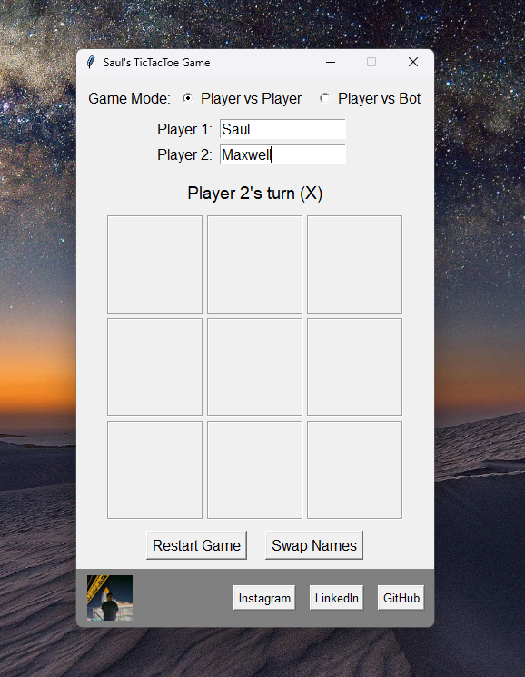

# 🎮 Saul's Tic Tac Toe Game

A modern **Tic Tac Toe** game built in Python using `tkinter` for the GUI and `Pillow` for image handling.  
This project is a fun, interactive spin on the classic 3x3 Tic Tac Toe game, designed to be simple to play but polished in presentation.  

Players can enjoy both **Player vs Player (PvP)** and **Player vs Bot (PvBot)** modes, with added features like name customization, game reset, alternating turns, and a built-in social bar linking to my GitHub, LinkedIn, and Instagram.  



---

## ✨ Features

- **Game Modes**:
  - 👫 **Player vs Player** – Classic mode with two human players.  
  - 🤖 **Player vs Bot** – Challenge a smart AI with randomized bot names.  
- **Bot AI**:
  - Blocks your winning moves.  
  - Takes winning moves when available.  
  - Plays strategically (center > corners > sides).  
  - Uses randomized bot nicknames for personality.  
- **UI Controls**:
  - Restart the game at any time.  
  - Swap player names (PvP only).  
  - Dynamic status bar for turn tracking, wins, and draws.  
- **Visual & Social Enhancements**:
  - Colored symbols: 🔴 X and 🔵 O.  
  - Smooth bot delays for realism.  
  - Social bar with GitHub, LinkedIn, and Instagram links.  
  - Optional profile image (`me1.jpg`).  

---

## 🛠️ Tech Stack

- **Language**: Python  
- **GUI Framework**: `tkinter`  
- **Image Handling**: `Pillow`  
- **Web Links**: `webbrowser`  
- **Random Bot Logic**: `random`  

---

## 🚀 Installation & Running

### Prerequisites
- Python 3.8+  
- Required libraries:  
  ```bash
  pip install pillow

---

# 📜 Changelog

## [2.0] – AI Opponent (Current)
### Added
- **Player vs Bot mode** with smart AI.  
- AI logic that:
  - Blocks human winning moves.  
  - Takes winning moves when available.  
  - Prioritizes center > corners > sides.  
- Randomized **funny bot names** for variety.  
- Colored symbols: 🔴 X and 🔵 O.  
- Social bar with clickable links to GitHub, LinkedIn, and Instagram.  

### Improved
- Added slight bot move delay for more realistic gameplay.  
- Alternating starting player each round.  

---

## [1.0] – Initial Release
### Added
- Classic **3x3 Tic Tac Toe gameplay**.  
- **Player vs Player (PvP) mode**.  
- Player name entry & swapping.  
- Win/draw detection with status updates.  
- Restart game functionality.  
- Embedded social bar with optional profile image (`me1.jpg`).  

---
