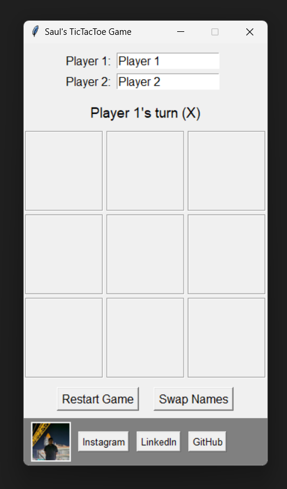

# 🎮 Saul's Tic Tac Toe Game

A clean, interactive, and GUI-based Tic Tac Toe game built using Python's `tkinter` module. This version features player name customization, dynamic turn switching, game reset, and embedded social links!



---

# 🧠 Features

- Classic 3x3 Tic Tac Toe gameplay
- Player name entry & swapping
- Turn-based UI with automatic tracking
- Win/draw detection with visual feedback
- Game reset functionality
- Embedded social media bar with clickable links
- Optional profile image display

---

# 🛠️ Tech Stack

- **Language**: Python
- **GUI Framework**: `tkinter`
- **Image Handling**: `Pillow`
- **Web Links**: `webbrowser`

---

# 🚀 Getting Started

### Prerequisites

Ensure you have Python installed (3.6 or later recommended). Then install the required library:

```bash
pip install pillow
